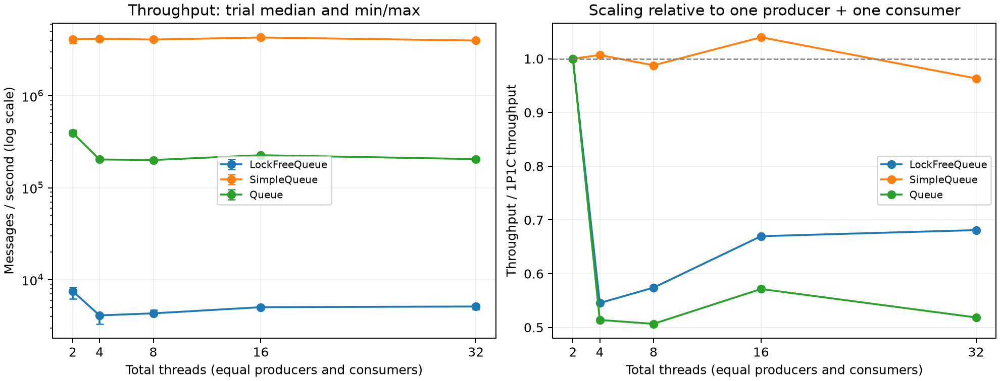
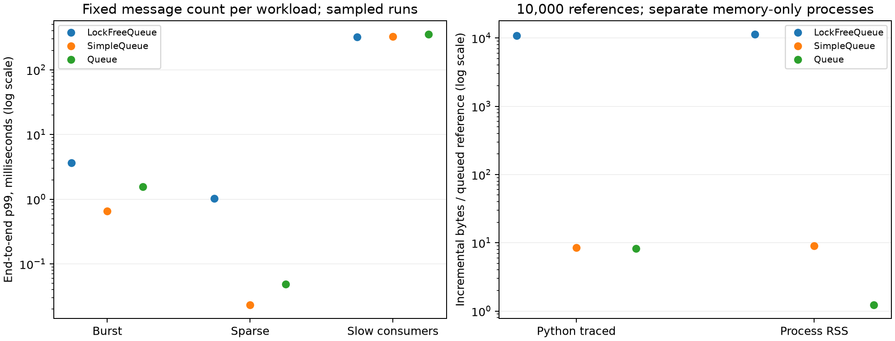

# 并发性能评估报告

测量时间：2026-09-13T08:34:39.367351+00:00 至 2026-09-13T08:38:14.871728+00:00。基线提交：`da3534f5efa7b005c127ffb73aa849bde110fbc1`。

## 结论

当前 Python CAS 队列在默认调度下，1P1C 吞吐中位数为 **7,519 条/秒**，4P4C 为 **4,316 条/秒**，16P16C 为 **5,121 条/秒**；32 个线程相对 2 个线程的吞吐为 **0.68 倍**。

同为 4P4C，`SimpleQueue` 和 `Queue` 的吞吐分别为本实现的 **947.8 倍**和 **46.4 倍**。本实现适合研究、验证原子 MPMC 算法；当前证据不支持将其作为 CPython 高吞吐队列的首选。

有优化空间，优先级是减少 Python/FFI 往返、每条消息的原子对象构造和不必要的空轮询。单纯增加线程不能绕过 GIL；降低内存序强度也不能消除这些主要成本。本次提交增加评估工具和报告，队列核心源码与基线提交保持一致，未把未经验证的算法改动混入测量。

## 环境与方法

- CPU：13th Gen Intel(R) Core(TM) i7-13700KF；物理核 16，逻辑 CPU 24，进程亲和性允许 24 个 CPU。
- 内存：63.86 GiB；系统：Windows-10-10.0.19045-SP0。
- Python：`3.12.10 (tags/v3.12.10:0cc8128, Apr  8 2025, 12:21:36) [MSC v.1943 64 bit (AMD64)]`；依赖：`{"atomics": "1.0.3", "cffi": "2.0.0", "psutil": "7.0.0"}`。
- 全机 CPU 占用的运行前/后短采样：9.0% / 7.8%。未独占机器、绑定核心或控制电源与睿频。
- 85 次校准，205 次正式测量；其中 201 次消息传递/内存测量全部通过交付校验。

每个测量点使用全新的子进程，先做 100 次顺序入队/出队预热；不同队列、负载和轮次用固定随机种子打散后串行执行。线程在计时前创建，准备好后同时释放；计时截至所有工作线程结束，包含结束标记、主线程调度及线程退出，不包含进程启动、队列构造、预建消息和最终完整性校验。吞吐单位是完成传递的消息/秒，不能将入队和出队重复计数。

吞吐场景按每种队列和配置校准消息量，目标每轮 0.4 秒，最多 50 万条；每个点正式测量 3 轮。消息量不同，因此跨队列比较的是各自有限批次的平均速率，不能解释成相同积压深度的排队延迟。预填充 drain 的入队不计时；fill 的出队校验不计时，二者单位分别是入队或出队条数/秒。

自动校准不是时长保证：非延迟场景中有 4 个配置至少一轮短于 100ms，最短 43.17ms。CSV/JSON 中保留最短时长、样本量、min/max 和变异系数，避免将小样本中位数当作精确常数。3 轮只刻画本次波动，不提供统计显著性或置信区间保证。

消息是预建元组，消费者仍执行引用校验与本地列表记录；这些共同的测试开销包含在计时中，尤其会限制标准库快队列的测得吞吐。逐条校验 ID 覆盖且不重复，并检查每个消费者看到的各生产者顺序；跨消费者返回日志不能重建全局线性化顺序，原有独立线性化测试负责验证该性质。

## 吞吐与线程扩展性

P 为生产者数量，C 为消费者数量。表内为 3 轮吞吐中位数；括号为最小—最大值。

| 配置 | LockFreeQueue（条/秒） | SimpleQueue（条/秒） | Queue（条/秒） |
| --- | ---: | ---: | ---: |
| scale_1p1c | 7,519 (6,201–8,247) | 4,141,562 (3,735,645–4,230,394) | 395,629 (388,034–426,058) |
| scale_2p2c | 4,101 (3,320–4,216) | 4,170,180 (4,123,762–4,287,400) | 203,312 (201,306–216,098) |
| scale_4p4c | 4,316 (4,297–4,682) | 4,090,967 (4,085,979–4,148,166) | 200,468 (199,097–201,477) |
| scale_8p8c | 5,036 (5,006–5,175) | 4,307,022 (4,101,514–4,333,064) | 226,110 (206,570–232,776) |
| scale_16p16c | 5,121 (4,763–5,411) | 3,989,961 (3,916,617–4,142,214) | 205,159 (198,159–213,873) |
| skew_8p1c | 8,805 (8,587–8,991) | 3,952,513 (3,935,843–4,015,655) | 331,664 (310,293–406,675) |
| skew_1p8c | 1,337 (1,186–1,445) | 4,365,737 (4,364,994–4,446,203) | 239,935 (219,046–299,002) |



下面区分排空、填充与同时读写，用于判断成本集中在生产还是消费路径。fill/drain 的数值不能直接当作一整次消息传递吞吐。

| 场景 | LockFreeQueue | SimpleQueue | Queue |
| --- | ---: | ---: | ---: |
| fill_1p | 16,300 | 11,222,891 | 1,956,921 |
| fill_8p | 11,942 | 10,548,835 | 428,304 |
| drain_1c | 45,291 | 6,729,883 | 1,762,052 |
| drain_8c | 39,291 | 7,080,137 | 423,838 |

## CPU、调度、竞争与分配公平性

CPU 核占用 = 进程 CPU 时间 / 墙钟时间，1.0 表示约占满一个逻辑核，不是整机 100%。消费者 Jain 指数在 1/C 到 1 之间，越接近 1 表示这批消息分配越均衡。它受批量长度和调度影响，不能证明无饥饿或 wait-free。上下文切换计数保留在 CSV/JSON 中，属于 psutil 的平台指标，不等同于 GIL 切换次数。
进程 CPU 时间包含原生库和内核执行；短切换间隔下超过一个核的 CPU 消耗，不代表 Python 字节码获得了相同倍数的并行加速。

| 队列 / 场景 | CPU 核占用 | CPU μs/条 | 空轮询/条 | Jain | 吞吐 CV |
| --- | ---: | ---: | ---: | ---: | ---: |
| LockFreeQueue / scale_1p1c | 1.13 | 143.18 | 2.63 | 1.000 | 11.6% |
| LockFreeQueue / scale_4p4c | 1.26 | 291.05 | 6.76 | 0.999 | 4.0% |
| LockFreeQueue / scale_16p16c | 1.25 | 230.82 | 4.84 | 0.982 | 5.2% |
| LockFreeQueue / switch_0.1ms | 7.46 | 13122.56 | 0.15 | 0.979 | 3.4% |
| SimpleQueue / scale_1p1c | 0.93 | 0.22 | 0.00 | 1.000 | 5.3% |
| SimpleQueue / scale_4p4c | 1.02 | 0.25 | 0.00 | 0.679 | 0.7% |
| SimpleQueue / scale_16p16c | 1.00 | 0.25 | 0.00 | 0.304 | 2.3% |
| SimpleQueue / switch_0.1ms | 5.81 | 10.64 | 0.00 | 0.999 | 2.8% |
| Queue / scale_1p1c | 1.12 | 2.76 | 0.00 | 1.000 | 4.1% |
| Queue / scale_4p4c | 1.23 | 6.18 | 0.01 | 1.000 | 0.5% |
| Queue / scale_16p16c | 1.23 | 6.00 | 0.06 | 0.918 | 3.1% |
| Queue / switch_0.1ms | 1.65 | 7.42 | 0.01 | 1.000 | 2.4% |

将 GIL 请求切换间隔从 5ms 降到 0.1ms 后，本实现 4P4C 的吞吐比例为 **0.136**。该参数不是精确的调度周期；它改变 Python 解释器与原生调用之间的竞争，不能据此单独归因于 CPU 缓存或 CAS 指令。

以下 CAS 计数来自独立的插桩进程。包装函数改变了调用成本及线程交错，因此仅用于诊断，不能与未插桩吞吐直接相除。计数包括结束标记和最后的空状态校验；空轮询与校验失败重试也会产生 load。

| 场景 | load/消息 | CAS 尝试/消息 | CAS 失败率 |
| --- | ---: | ---: | ---: |
| scale_1p1c | 26.71 | 3.01 | 0.26% |
| scale_4p4c | 41.56 | 3.02 | 0.36% |
| scale_16p16c | 31.10 | 3.05 | 0.19% |
| switch_0.1ms | 27.66 | 6.57 | 54.14% |

## 调用延迟与端到端延迟

端到端延迟从生产者调用 put 前开始，到消费者 get 返回后结束，包含入队执行、队列等待及出队执行，不是只测队列驻留时间。put 延迟也包含为采样消息添加时间戳的成本；get 延迟只统计采样到的成功调用。

burst 为 4P4C 共 4,096 条消息，每个生产者每 4 条采样一次；sparse 为 1P1C 共 400 条，每次生产后请求 sleep(1ms)；slow_consumer 为 4P4C 共 1,024 条，每次消费后请求 sleep(1ms)。后两者逐条采样。sleep 的实际长度依赖 Windows 调度，稀疏场景没有强制达到固定到达率。三个队列在同一延迟场景使用相同消息量，避免将不同积压深度的 p99 直接比较。

百分位使用 nearest-rank。表中是**各轮百分位的中位数**，不是合并原始样本后的百分位。CSV 中的 max_us 则取所有轮次观测到的最大值。这是有限批次、生产者闭环生成的延迟，存在 coordinated omission：生产者阻塞/变慢时不会补记应到达请求，因此不能当作固定外部到达率下的服务 SLA，也不能据此预测长期 p99.9。

| 队列 / 场景 | put p99 μs | get p99 μs | 端到端 p50 ms | p95 ms | p99 ms | 端到端样本总数 |
| --- | ---: | ---: | ---: | ---: | ---: | ---: |
| LockFreeQueue / latency_burst | 3510.90 | 837.50 | 0.770 | 2.574 | 3.630 | 3072 |
| SimpleQueue / latency_burst | 1.40 | 0.40 | 0.478 | 0.655 | 0.661 | 3072 |
| Queue / latency_burst | 1.40 | 0.70 | 1.319 | 1.557 | 1.562 | 3072 |
| LockFreeQueue / latency_sparse | 974.80 | 235.20 | 0.174 | 0.646 | 1.029 | 1200 |
| SimpleQueue / latency_sparse | 5.10 | 2.10 | 0.009 | 0.016 | 0.023 | 1200 |
| Queue / latency_sparse | 8.70 | 7.30 | 0.014 | 0.025 | 0.049 | 1200 |
| LockFreeQueue / latency_slow_consumer | 1547.20 | 133.50 | 165.613 | 306.495 | 320.018 | 3072 |
| SimpleQueue / latency_slow_consumer | 1.20 | 4.90 | 170.864 | 315.994 | 328.358 | 3072 |
| Queue / latency_slow_consumer | 1.80 | 10.30 | 179.464 | 342.092 | 356.442 | 3072 |



## 对象大小、空轮询与可直接应用的配置优化

在 4P4C 中，消息携带共享 64KiB bytes 引用时，本实现吞吐为 4,164 条/秒，相对空 bytes 引用为 0.96 倍。该实验没有复制或序列化 64KiB 数据，只能评估引用传递，不能换算为网络或内存拷贝 GB/s。差异也包含独立校准、批量长度与调度波动，不表示对象越大越快或越慢。

消费者遇到 Empty 后，将 sleep(0) 改为请求 sleep(0.5ms)，本实现吞吐从 4,316 变为 9,624 条/秒（2.23 倍）；空轮询从 6.76 变为 0.35 次/条。退避位于调用方，不修改队列算法；可能提高空闲 CPU 效率，也会增加消息唤醒等待，不能据吞吐试验宣称尾延迟改善。
两种设置分别校准了批量长度，观察到的速率差异尚未排除批量大小的影响；上线前应在固定消息量和真实到达率下复测。

## 内存与回收

各场景只存储同一个既有对象的引用。RSS 与 tracemalloc 使用不同子进程测量，避免 tracemalloc 自身的追踪结构污染 RSS。在空队列、填充后、排空后、销毁后分别 gc.collect 并取样。tracemalloc 只覆盖可追踪 Python 分配；RSS 包含原生内存、解释器及分配器保留页，不能简单相减来精确计算原生节点大小。

| 队列 | 积压条数 | 指标 | 填充增量 MiB | 排空后残留 KiB | 销毁后相对初始 KiB |
| --- | ---: | --- | ---: | ---: | ---: |
| LockFreeQueue | 1,000 | rss | 10.586 | 7080.00 | 6796.00 |
| LockFreeQueue | 1,000 | tracemalloc | 10.302 | 59.11 | 24.93 |
| LockFreeQueue | 10,000 | rss | 108.879 | 34556.00 | 33960.00 |
| LockFreeQueue | 10,000 | tracemalloc | 102.809 | 312.55 | 26.38 |
| Queue | 1,000 | rss | 0.000 | 0.00 | 4.00 |
| Queue | 1,000 | tracemalloc | 0.008 | 8.73 | 0.83 |
| Queue | 10,000 | rss | 0.012 | 12.00 | 16.00 |
| Queue | 10,000 | tracemalloc | 0.079 | 8.73 | 0.83 |
| SimpleQueue | 1,000 | rss | 0.004 | 4.00 | 8.00 |
| SimpleQueue | 1,000 | tracemalloc | 0.009 | 0.45 | 0.83 |
| SimpleQueue | 10,000 | rss | 0.086 | 88.00 | 92.00 |
| SimpleQueue | 10,000 | tracemalloc | 0.081 | 0.45 | 0.83 |

本实现排空 10,000 条消息后，节点注册表长度为 1，但字典自身仍保留约 **288.1 KiB** 的容量。节点/载荷释放与字典容量收缩、RSS 归还操作系统是不同问题；RSS 残留不能直接判定为节点泄漏。当前队列不提供背压，生产长期快于消费时内存仍随积压增长。

## 原子原语与函数分析

以下为顺序微基准，每轮 5,000 次、3 轮中位数；含 Python 调用开销，noop 用于显示计时循环成本，没有从其他行中强行扣除。构造包括返回临时对象的释放；成功 CAS 使用 0→0，测的是成功路径，不模拟真实缓存行竞争。

| 操作 | μs/次 |
| --- | ---: |
| noop | 0.021 |
| atomic_construct | 22.192 |
| atomic_load | 3.104 |
| atomic_cas_success | 6.455 |
| atomic_cas_failure | 6.406 |
| queue_put_get_pair | 68.991 |
| empty_get_exception | 12.618 |
| empty_try_get | 12.854 |
| empty_snapshot | 9.341 |

独立 cProfile 运行 1,000 次顺序 put/get，按累计时间排序的前 12 项如下。累计时间相互包含，不能相加为百分比；插桩时间不能视为未插桩吞吐，也不能从单线程 profile 判断硬件缓存争用。

| 函数 | 调用数 | 自身 ms | 累计 ms |
| --- | ---: | ---: | ---: |
| `_queue.py:62:put_nowait` | 1,000 | 2.29 | 211.16 |
| `_atomic.py:24:load` | 7,000 | 1.78 | 107.70 |
| `intops.py:42:load` | 7,000 | 7.20 | 105.92 |
| `_atomic.py:27:compare_exchange` | 3,000 | 1.07 | 99.54 |
| `intops.py:56:cmpxchg_strong` | 3,000 | 1.08 | 98.47 |
| `intops.py:16:_impl_cmpxchg` | 3,000 | 9.29 | 97.39 |
| `_queue.py:94:get_nowait` | 1,000 | 2.01 | 95.92 |
| `_queue.py:26:__init__` | 1,000 | 0.53 | 94.82 |
| `_atomic.py:17:__init__` | 1,000 | 1.50 | 94.29 |
| `byteops.py:105:load` | 7,000 | 18.97 | 88.73 |
| `funcs.py:62:atomic` | 1,000 | 0.71 | 71.22 |
| `int.py:32:__init__` | 1,000 | 0.64 | 70.51 |

## 优化空间与优先级

| 优先级 | 建议 | 依据与可能收益 | 代价 / 验证要求 |
| --- | --- | --- | --- |
| P0：选型 | 普通 CPython 业务优先评估 SimpleQueue；需要阻塞、容量限制或任务计数时选 Queue | 本次各队列实测提供直接对照；原生标准库路径减少 Python 包装成本 | 不保留当前算法级无锁目标，需按业务语义选择 |
| P1：应用配置 | 限制线程数，消费者为空时采用有上限的自适应退避 | 线程扩展曲线与 backoff 对照可直接复验，不需要改核心算法 | 退避增大唤醒延迟，需补测目标流量的开放环延迟 |
| P1：原生实现 | 将完整入队/出队循环和节点布局迁移到 C/C++/Rust 扩展，减少每次操作的 Python/FFI 往返 | 原语成本与 profile 表明不能只优化一条 CAS；当前成功路径至少 7 次 load、3 次 CAS及节点构造 | 高工作量；需设计 GIL 边界、PyObject 引用生命周期、异常路径和安全回收，不能直接宣称端到端 lock-free |
| P2：分配 | 探索紧凑节点、原子操作元数据复用、预分配节点池 | 每条消息构造 AtomicUInt64，内存测量显示对象图开销；可先测原型 | 不依赖 atomics 私有接口；回收复用必须保留不重用 token/代数或引入可靠 ABA 防护，需重跑指定交错和线性化测试 |
| P2：容量治理 | 增加明确的背压策略；在业务确认无并发访问的生命周期边界重建空队列 | 无界队列会积压，字典在排空后保留容量 | 有界队列改变接口/算法；不能在并发读写期间直接 clear 或替换注册表 |
| P3：批处理或分片 | 根据业务允许的顺序范围减少每消息协调次数 | 有机会摊薄 Python 调用成本；本次没有给出实现或量化收益 | 批量原子语义、全局 FIFO 与每分片 FIFO 不同，必须先定义需求再实现 |
| P3：内存序/缓存布局 | 仅在原生实现确定后评估 acquire/release、缓存行布局 | 目前缺少硬件计数器证据，Python 包装成本可见 | 弱内存序需要完整发布/读取证明和跨架构测试，不能仅凭 x64 测试通过就替换 SEQ_CST |

除消费者退避和线程配置对照外，上述实现优化是候选方向，尚未完成前后对照验证，不能承诺具体加速比例。Python GIL、内存分配器及 GC 仍可能阻塞；队列算法使用原生 CAS 不等于整个 Python 调用链严格无锁。

## 数据完整性与复现

```powershell
python -m pip install -e ".[test,benchmark]"
python -m pytest -q
python -m benchmarks.evaluate --output docs/performance/raw.json --rounds 3 --target-seconds 0.4
python -m benchmarks.report --input docs/performance/raw.json
```

仅复测部分吞吐场景可使用 `--only scale_1p1c,scale_4p4c --output docs/performance/subset.json`。完整报告生成器要求完整场景集；子集文件用于单独分析，不替换完整报告数据。子进程默认硬超时 90 秒；超时或异常写入结果文件，报告生成器拒绝发布未完成的测量。

- [原始测量及环境、源码 SHA-256](performance/raw.json)：包含校准、每轮样本量、CPU、GC、消费者计数、CAS 诊断、内存快照和 profile。
- [汇总 JSON](performance/summary.json)、[吞吐及延迟 CSV](performance/transfers.csv)、[内存 CSV](performance/memory.csv)。
- [评估脚本](../benchmarks/evaluate.py)、[报告生成脚本](../benchmarks/report.py)。
- [本次测试与数据核对记录](performance/validation.txt)：84 项测试通过，并核对了被测源码哈希、场景完整性和报告链接。

本报告是当前单机、单个 CPython 版本的有限负载评估，不覆盖多进程、无 GIL Python、长期稳态、真实网络 I/O、序列化成本、固定外部到达率、NUMA 或硬实时场景。需要生产容量结论时，应增加独占机器多轮测试、开放环速率扫描与过载恢复、长时间 RSS 趋势和目标业务任务处理成本。
